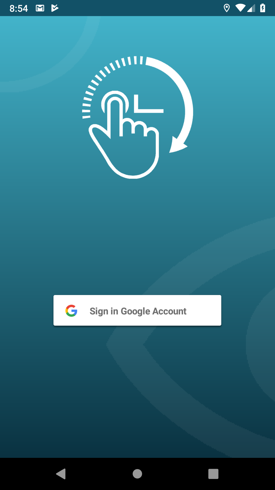
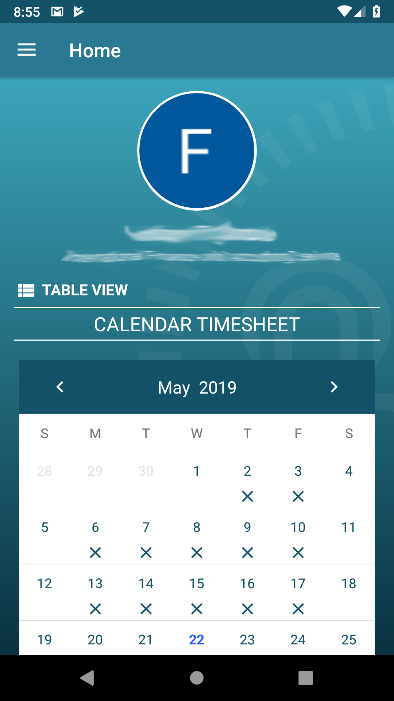
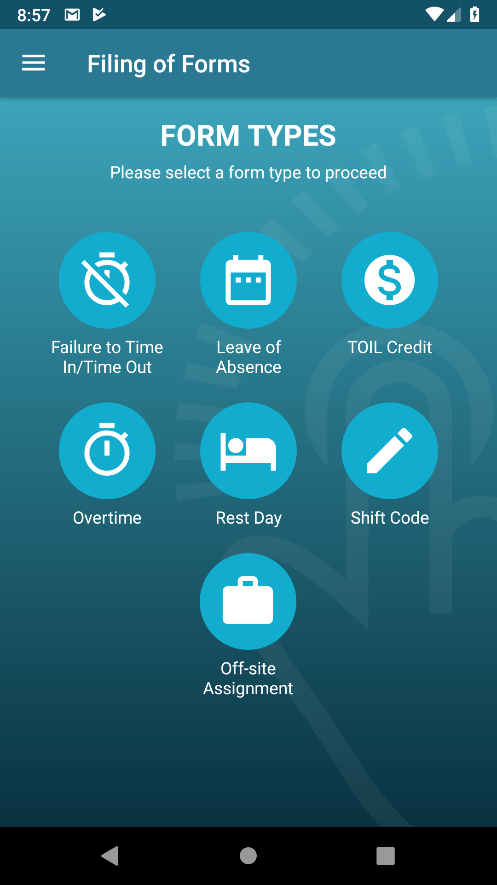
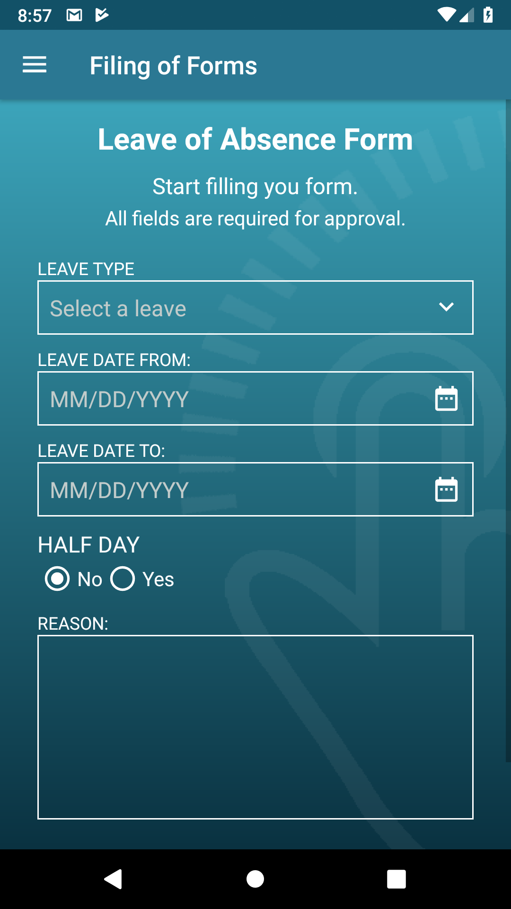
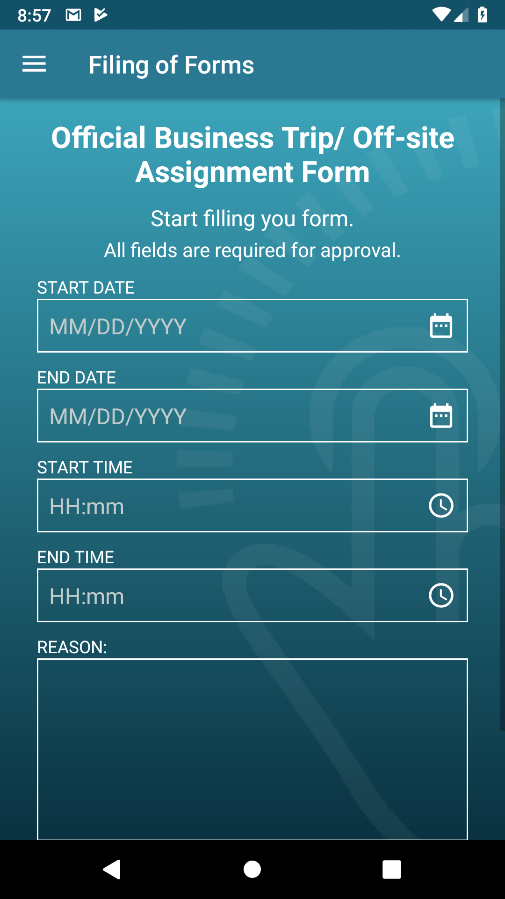
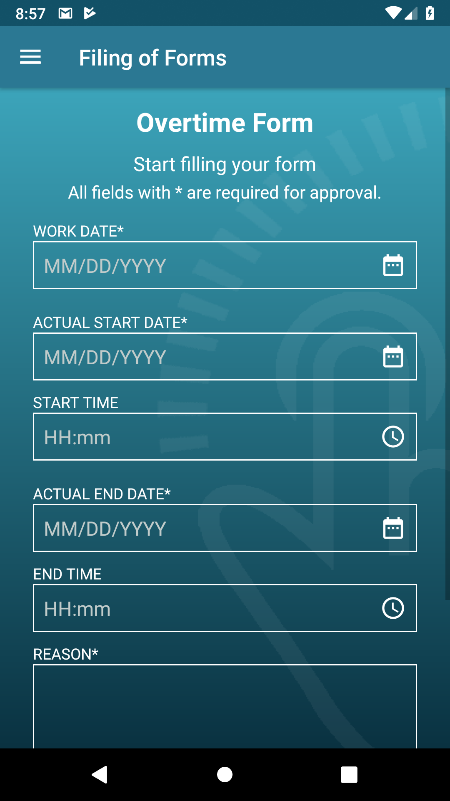
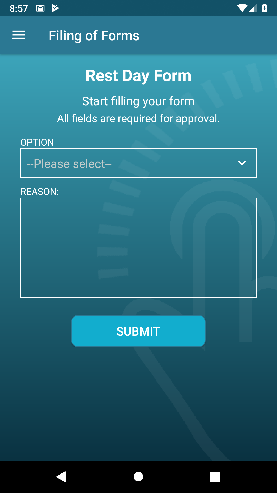
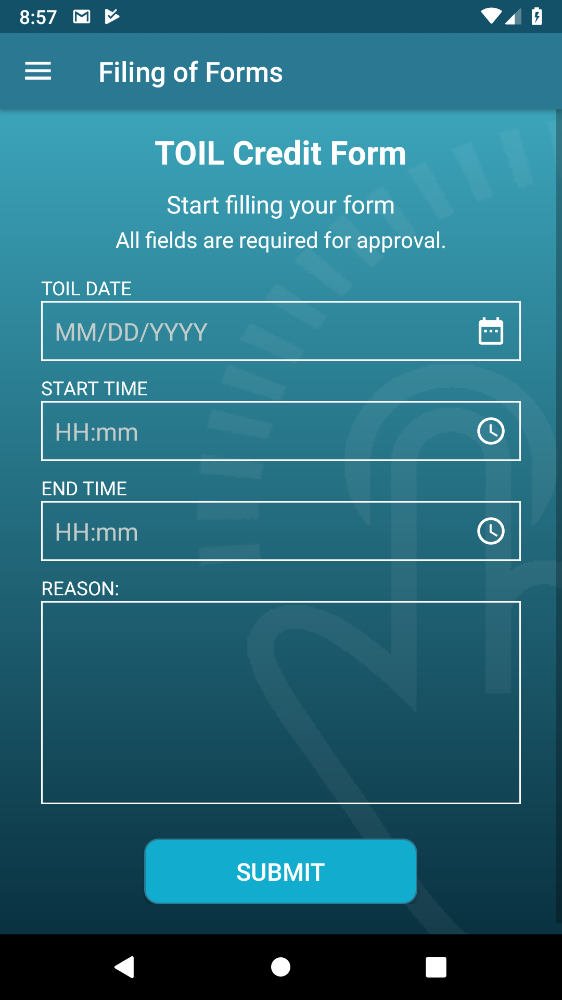
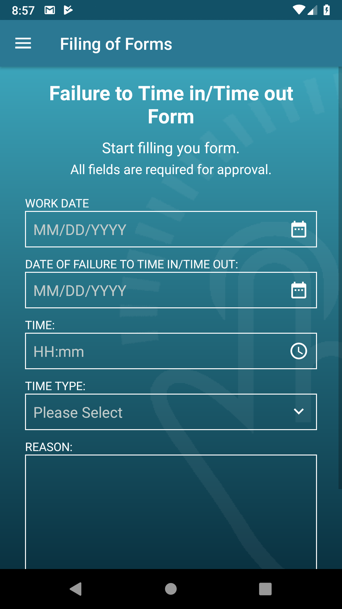

# ChronoTAP

  

<b>ChronoTAP</b>

&nbsp;&nbsp;&nbsp;&nbsp;&nbsp;ChronoTAP is an android application that can manage your time in the company. It displays your time in and time out to the company. The app has also has form that you can submit to the admin to apply for Leave, Failure to time in/time out, TOIL Credit, Overtime, Rest day, Shift Code and Offsite assignment. Lastly it has a functionality that you can approve those forms with the right position.
  
The application is built with Android Studio and uses PHP for server communication.

<h3>Home</h3>

<h3>Form Category</h3>

<h3>Leave Form</h3>

<h3>OBT Form</h3>

<h3>Overtime Form</h3>

<h3>Restday Form</h3>

<h3>TOIL Form</h3>

<h3>Failure to Time in/Time out form</h3>

